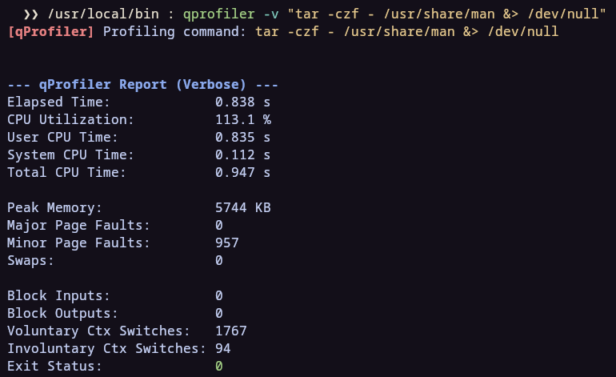

<p align="center">
  <picture>
    
  </picture>
</p>

## Overview

**qProfiler** is a command-line profiling tool designed to be both quick and simple. It allows developers and system administrators to measure the performance of any command or executable with ease, providing insights into time, CPU usage, and memory consumption.

## Installation

You can install qProfiler with a single command using the automated installer:

```bash
bash <(curl -fsSL https://raw.githubusercontent.com/RedeemedSpoon/qProfiler/master/install.sh)
```

### Manual Installation
If you prefer to build it yourself:

1. Clone the repository:
   ```bash
   git clone https://github.com/RedeemedSpoon/qProfiler.git
   cd qProfiler
   ```
2. Build and install:
   ```bash
   mkdir build && cd build
   cmake ..
   make
   sudo mv ./bin/qprofiler /usr/local/bin/
   ```

## Usage

The basic syntax is:

```bash
qprofiler [options] <command> # can use "<command>" for complex operations like piping
```

### Options

| Flag | Long Flag | Description |
| :--- | :--- | :--- |
| `-o` | `--output <file>` | Write the report to a file instead of stdout. |
| `-a` | `--append` | Append to the output file if it exists (use with `-o`). |
| `-f` | `--format <fmt>` | Set output format. Options: `txt`, `csv`, `json`. |
| `-v` | `--verbose` | Display all available performance metrics (see below). |
| `-x` | `--explain` | Print a detailed explanation of each metric and exit. |
| `-h` | `--help` | Display help message. |
| `-V` | `--version` | Display version information. |


## Metrics

qProfiler provides two levels of detail depending on your needs.

### Default Metrics
Standard metrics for quick performance checks:
*   Elapsed Time
*   User CPU Time
*   System CPU Time
*   Total CPU Time
*   CPU Utilization
*   Peak Memory Usage
*   Block Input/Output Operations
*   Exit Status

### Verbose Metrics (`--verbose`)
Deep dive into system-level counters:
*   **All Default Metrics**
*   Major & Minor Page Faults
*   Swaps
*   Voluntary & Involuntary Context Switches

## Contributing

Contributions are what make the open-source community such an amazing place to learn, inspire, and create. Any contributions you make are **greatly appreciated**.

If you have a suggestion that would make this better, please fork the repo and create a pull request. You can also simply open an issue with the tag "enhancement".

1.  **Fork the Project**
2.  **Create your Feature Branch** (`git checkout -b feature/AmazingFeature`)
3.  **Commit your Changes** (`git commit -m 'Add some AmazingFeature'`)
4.  **Push to the Branch** (`git push origin feature/AmazingFeature`)
5.  **Open a Pull Request**

## License

Distributed under the GPLv3 License. See the `LICENSE` file for more information.
